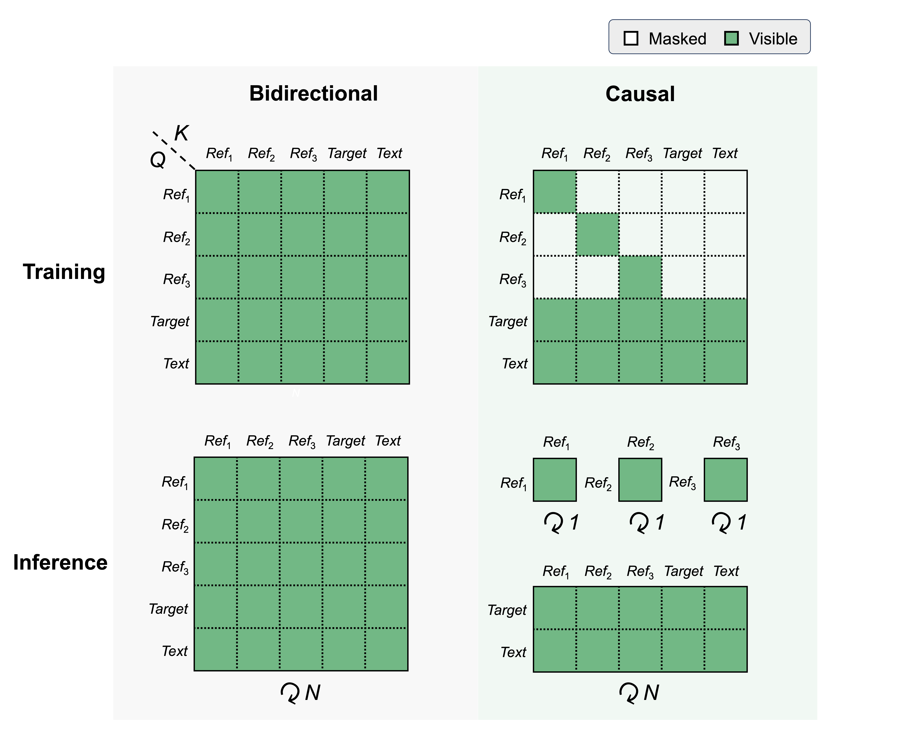
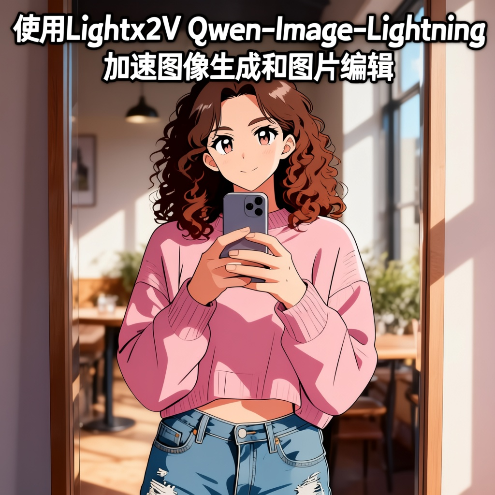
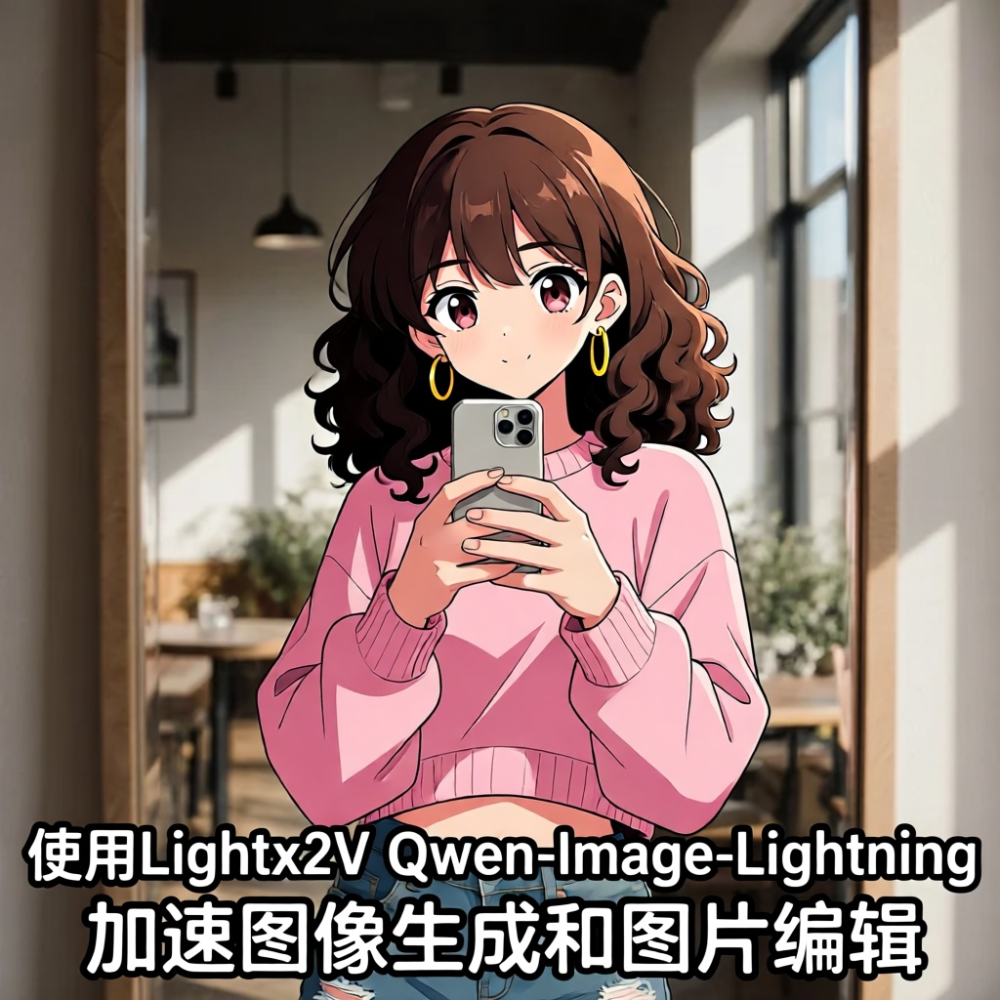
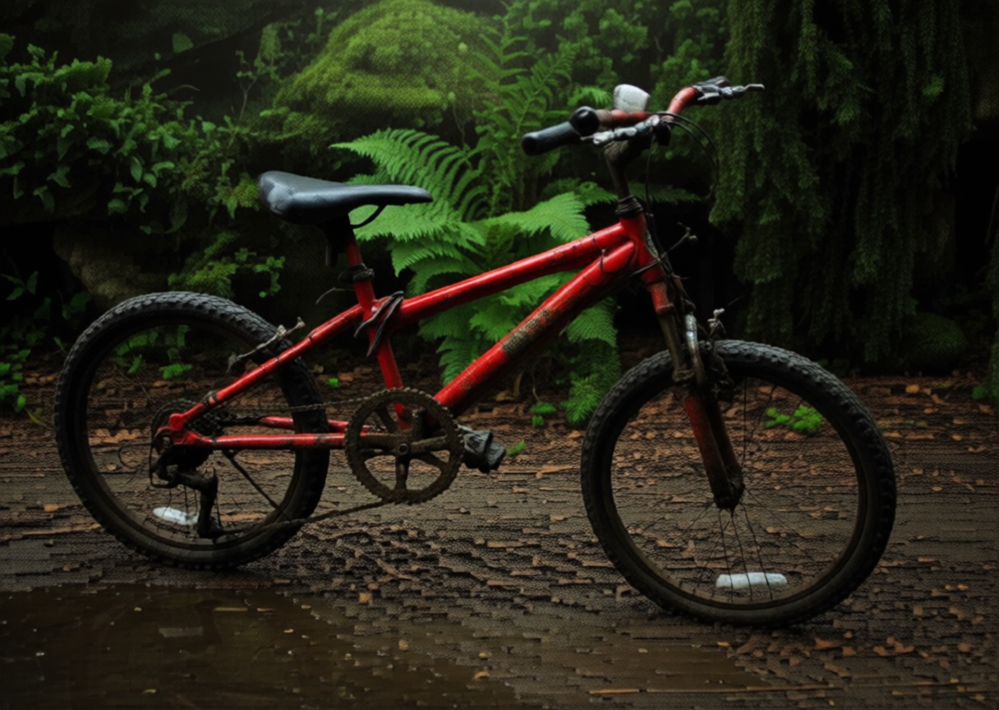
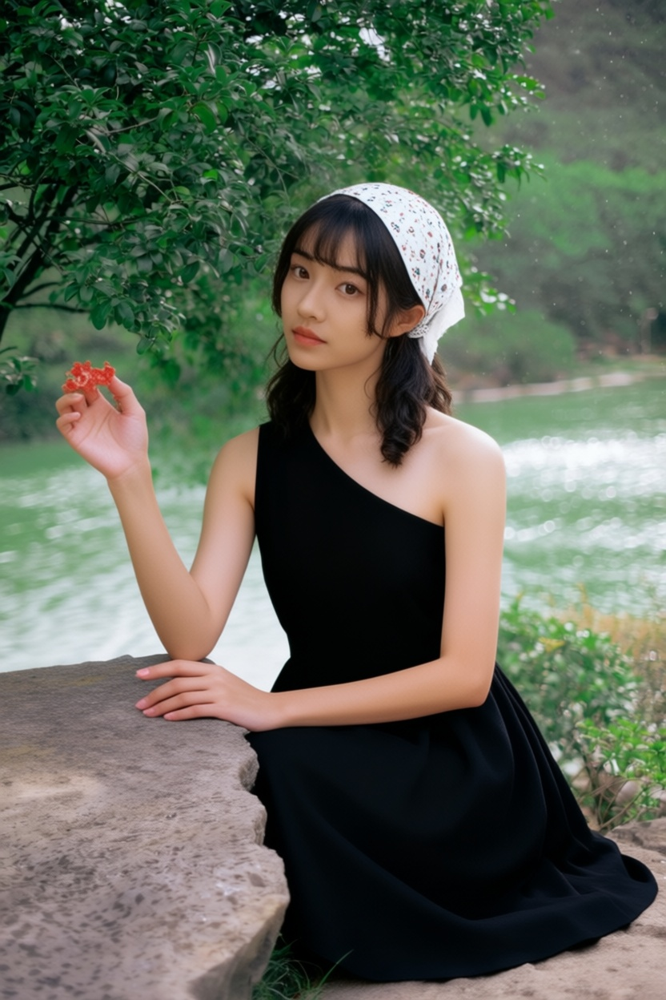

# QQwen-Image-Edit-Causal

We employ block causal attention to improve inference speed of [Qwen-Image-Edit-2511](https://huggingface.co/Qwen/Qwen-Image-Edit-2511).

## 🔥 Latest News
* Jan 01, 2026: 👋 Release [Qwen-Image-Edit-Causal-V1.0](https://huggingface.co/lightx2v/Qwen-Image-2512-Lightning/blob/main/Qwen-Image-2512-Lightning-4steps-V1.0-fp32.safetensors).


## 📑 Todo List

* [x] Qwen-Image-Edit-Causal
* [ ] Qwen-Image-Edit-Interactive (multi-turn edit)


## 📑 Methodology
The figure below illustrates the core design of `Qwen-Image-Edit-Causal`: reference-image queries attend only to their own keys and values, which reduces training-time computation and decouples the attention of reference images from the number of inference steps.




## 📑 Performance Reports

We compare the performance of `Qwen-Image-Edit-Causal` and `Qwen-Image-Edit-2511`.

| Input Image | Prompt | Qwen-Image-Edit-2511 40steps | Qwen-Image-Edit-Causal 4steps |
|---|---|---|---|
|    | Make the girl from Image 1 wear the necklace from Image 2 and carry the bag from Image 3 on her left shoulder. |  |  |
|   | The monk in the Image 1 and The woman in the Image 2 are standing close, holding hands, suggesting a moment of connection or intimacy. They appear to be in a grand hall with ornate lighting and decorations, indicating a formal or celebratory setting. The shot size is medium, capturing both characters from the waist up, allowing for a clear view of their expressions and upper body gestures. |  |  |
|  | Change the character's hair color from blonde to white, and add a hard side light coming from the right side of the image, so the shadows on the left half of the face become more pronounced. |  |  |
|  | 将图中的人物改为日漫风格，并给图片添加文字“使用Lightx2V Qwen-Image-Lightning 加速图像生成和图片编辑”。 |  |  |
|  | Generate an image that matches the depth map, following this description: A dilapidated red bicycle is parked on a muddy path with a dense primeval forest in the background. |  |  |
|    | Make the girl from Image 1 wear the black dress from Image 2 and sit in the pose from Image 3. |  |  |
|  |  | |Limitation: Due to the absence of certain data types, our model underperforms the original bidirectional model in some cases, such as the following of keypoints. |


## 🚀 Run Evaluation and Test with Diffusers

### Installation

Install python environment with [UV](https://github.com/astral-sh/uv)

```sh
git clone https://github.com/ModelTC/Qwen-Image-Edit-Causal.git
cd Qwen-Image-Edit-Causal
uv venv
uv sync
```

### Model Download

Download models using huggingface-cli:

``` sh
pip install "huggingface_hub[cli]"
huggingface-cli download lightx2v/Qwen-Image-Edit-Causal --local-dir ./Qwen-Image-Edit-Causal
```

### Run Qwen-Image-Edit-Causal Model

``` sh
python generate_with_diffusers.py \
--model_name lightx2v/Qwen-Image-Edit-Causal \
--prompt_list_file examples/prompt_list.txt \
--image_path_list_file examples/image_path_list.txt \
--out_dir results/Qwen-Image-Edit-Causal \
--base_seed 42 --steps 4 --cfg 1.0
```


## License Agreement

The models in this repository are licensed under the Apache 2.0 License. We claim no rights over your generated contents, granting you the freedom to use them while ensuring that your usage complies with the provisions of this license. You are fully accountable for your use of the models, which must not involve sharing any content that violates applicable laws, causes harm to individuals or groups, disseminates personal information intended for harm, spreads misinformation, or targets vulnerable populations. For a complete list of restrictions and details regarding your rights, please refer to the full text of the [license](LICENSE.txt).

## Acknowledgements

We built upon and reused code from the following projects: [Qwen-Image](https://github.com/QwenLM/Qwen-Image), [Qwen-Image-Lightning](https://github.com/ModelTC/Qwen-Image-Lightning), licensed under the Apache License 2.0.

The evaluation text prompts are from [Qwen-Image](https://github.com/QwenLM/Qwen-Image), [Qwen-Image Blog](https://qwenlm.github.io/blog/qwen-image/) and [Qwen-Image-Service](https://huggingface.co/spaces/Qwen/Qwen-Image).

The test cases for Image Editing are from [Qwen-Image-Edit-api](https://www.alibabacloud.com/help/en/model-studio/qwen-image-edit-api), [reddit](https://www.reddit.com/r/comfyui/comments/1mue7k0/testing_the_new_qwen_image_editing_q4_gguf_and_4/) and [Chat-Qwen-AI](https://chat.qwen.ai/)
